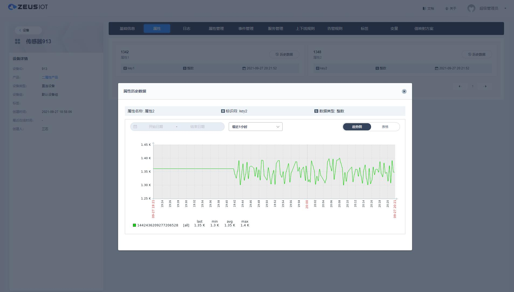

<b>Zeus IoT is the world's first open source IoT <i>distributed collection platform</i> based on Zabbix</b>

----

## Abstract
[Zeus IoT](https://www.zmops.com/) is a **distributed IoT collection, analysis, and storage platform**,It is the world's first IoT open source platform based on zabbix secondary development, all this relies on a group of engineers with rich experience in zabbix development.It is hoped that through the community’s open source ecology, continuous improvement and continuous updates will make some contributions to the development of the Internet of Things industry.

The following screenshots give a close insight into Zeus IoT.
<table>
  <tr>
      <td width="50%" align="center"><b>Home Screen</b></td>
      <td width="50%" align="center"><b>Device Resources</b></td>
  </tr>
  <tr>
     <td></td>
     <td></td>
  </tr>
  <tr>
      <td width="50%" align="center"><b>Realtime Data</b></td>
      <td width="50%" align="center"><b>System Users</b></td>
  </tr>
  <tr>
     <td></td>
     <td></td>
  </tr>
</table>

## Technology stack
- Basic components: Zabbix 5.4+
- Database: Postgresql 12+
- Webapp: SpringBoot 2  +  [Ebean](https://ebean.io/)  +  Vue Element + Socket.IO
- IoT Server:  Apache Camel 2.2 + Modular design
- Visualization: Grafana 8.0+

## Demo Environment

Using the account `Admin / zeus123` to log in the [demo environment](https://zeusdemo.zmops.cn/). Please note the account is granted view access. 